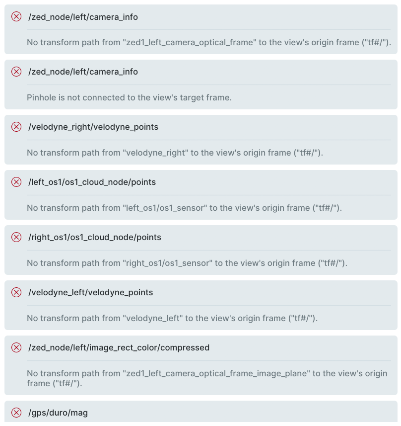
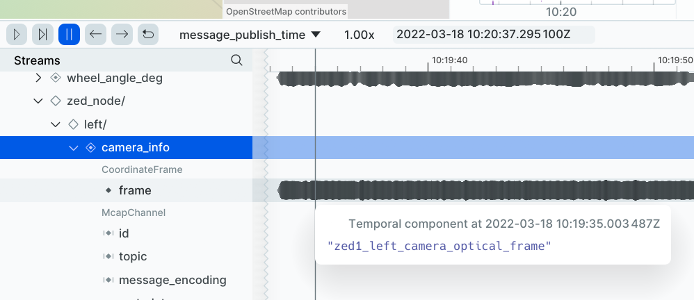
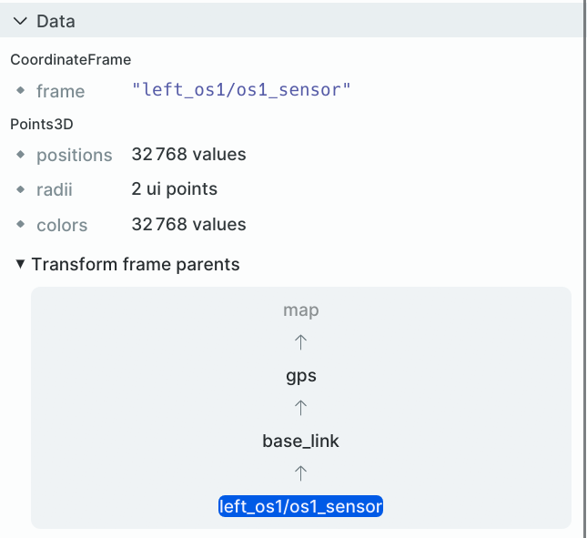
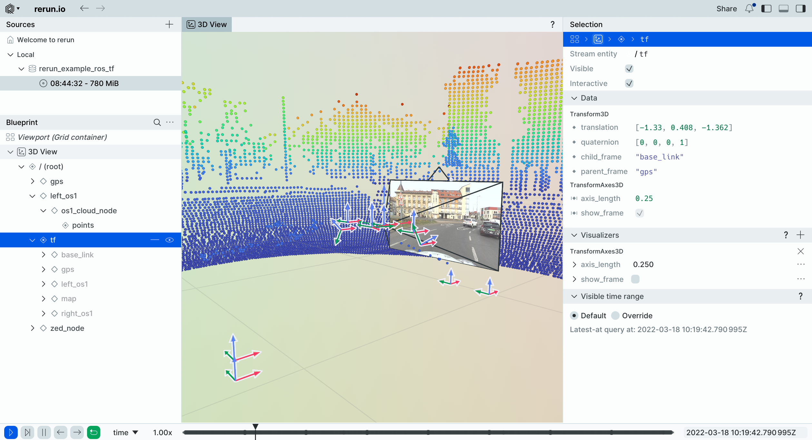
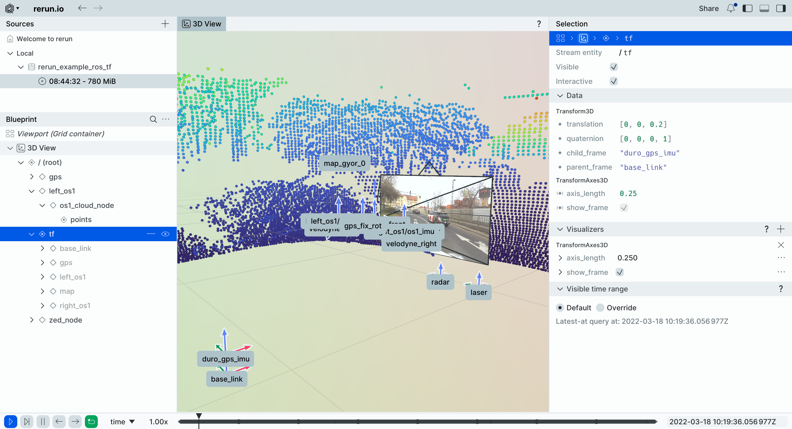
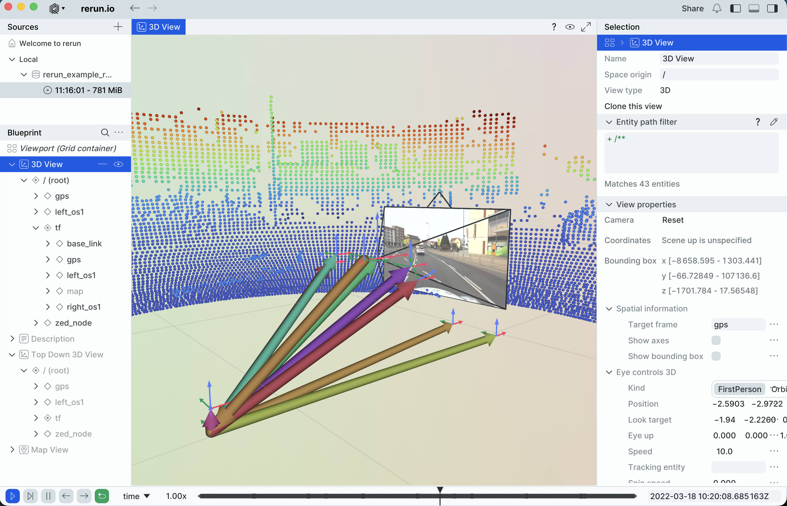
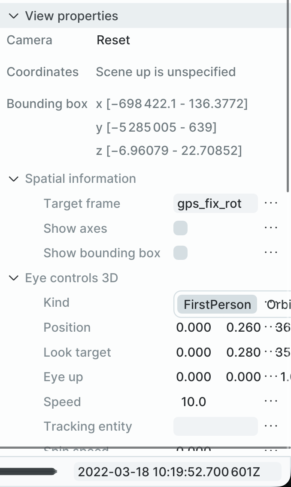

# ROS TF example

<picture>
 
</picture>

## Used Rerun types

[`Transform3D`](https://www.rerun.io/docs/reference/types/archetypes/transform3d), [`CoordinateFrame`](https://rerun.io/docs/reference/types/archetypes/coordinate_frame), [`Pinhole`](https://rerun.io/docs/reference/types/archetypes/pinhole), [`TransformAxes3D`](https://rerun.io/docs/reference/types/archetypes/transform_axes3d), [`GeoPoints`](https://rerun.io/docs/reference/types/archetypes/geo_points), [`EncodedImage`](https://rerun.io/docs/reference/types/archetypes/encoded_image), [`Points3D`](https://rerun.io/docs/reference/types/archetypes/points3d)

## Overview

ROS 2 uses the transform library, [tf2](https://docs.ros.org/en/jazzy/Concepts/Intermediate/About-Tf2.html), to track multiple coordinate frames over time. It is a powerful system that allows developers to transform points, vectors, and poses between different frames of reference (e.g., from a "camera_link" to "base_link"). This system makes collaboration between developers around the world easier, as it provides a common language for how transforms should be handled — a topic that can otherwise be defined in many different ways. In Rerun, you can use [named transforms](https://rerun.io/docs/concepts/logging-and-ingestion/transforms#named-transform-frames) to decouple spatial relationships from the entity hierarchy, similar to as it is done in ROS.

The Rerun documentation already contain guides for how to work with named transforms and how to turn your ROS 2 transforms into Rerun transforms (see section *useful resources* below). Instead of repeating the documentation, this example will show you how to debug your system when transforms do not work. For this, we will use the [JKK Research Center](https://jkk-research.github.io/dataset/jkk_dataset_01/) dataset. You will see that when simply dropping the dataset into the Rerun viewer, it will complain about missing transforms and broken transform paths. We will go through how to debug and fix these problems.

## Useful resources

Below you will find a collection of useful Rerun resources for this example:

* [Concepts — Transforms & Coordinate Frames](https://rerun.io/docs/concepts/logging-and-ingestion/transforms)
  * Highly recommend reading to understand how Rerun defines and handles transforms and coordinate frames. Rerun's system has both similarities and differences to the system ROS uses and reading this page will help you grasp these similarities and differences. You will also see how flexible and powerful Rerun's system is.
* [How-to — Use Rerun with ROS 2](https://rerun.io/docs/howto/integrations/ros2-nav-turtlebot)
  * A practical guide for ROS 2 integration. For this example, it can be good to, at least, read the section [TF to rr.Transform3D](https://rerun.io/docs/howto/integrations/ros2-nav-turtlebot#tf-to-rrtransform3d).
* [MCAP — ROS 2 transforms (TF)](https://rerun.io/docs/concepts/logging-and-ingestion/mcap/message-formats#ros-2-transforms-tf)
  * Describes the technical conversion of [`tf2_msgs/msg/TFMessage`](https://docs.ros.org/en/jazzy/p/tf2_msgs/msg/TFMessage.html) to [`Transform3D`](https://www.rerun.io/docs/reference/types/archetypes/transform3d) when using MCAP's in Rerun.
* [MCAP — ROS 2 poses and frame IDs](https://rerun.io/docs/concepts/logging-and-ingestion/mcap/message-formats#ros-2-poses-and-frame-ids)
  * Describes the technical conversion of a message's header frame ID to [`CoordinateFrame`](https://rerun.io/docs/reference/types/archetypes/coordinate_frame) when using MCAP's in Rerun.

## Example

First you will need to clone this repo:

```sh
git clone https://github.com/rerun-io/ros_tf_example.git
cd ros_tf_example
```

We assume you are running all commands within the `ros_tf_example` repository folder and using the [Pixi](https://pixi.sh/latest/#installation) package manager for environment setup.

### Setup

#### 1. Download dataset

Download the ROS 1 bag file (`leaf-2022-03-18-gyor.bag`) from the [JKK Research Center](https://jkk-research.github.io/dataset/jkk_dataset_01/) or using `wget`:

```sh
wget https://laesze-my.sharepoint.com/:u:/g/personal/herno_o365_sze_hu/EVlk6YgDtj9BrzIE8djt-rwBZ47q9NwcbgxU_zOuBji9IA?download=1 -O leaf-2022-03-18-gyor.bag
```

This dataset includes transforms, camera images, LiDAR point clouds, poses, IMU, and GPS.

#### 2. Convert to MCAP (via Rosbags)

Use [Rosbags's](https://ternaris.gitlab.io/rosbags/) `rosbags-convert` tool within the Pixi environment to convert the ROS 1 bag to MCAP:

```sh
pixi run rosbags-convert --dst-storage mcap --src leaf-2022-03-18-gyor.bag --dst leaf-2022-03-18-gyor
```

**NOTE**: `pixi run` in the above command means that we are running the `rosbags-convert` command inside the Pixi environment where we have installed the [Rosbags](https://ternaris.gitlab.io/rosbags/) library.

This creates a folder `leaf-2022-03-18-gyor` containing the `leaf-2022-03-18-gyor.mcap` file.

#### 3. Convert to RRD

Altough, you can directly load the MCAP file into the Rerun viewer, we will convert it one step further into a native Rerun file (RRD). This is because during this conversion, it will take known ROS message types and turn them into Rerun archetypes. To do the MCAP to RRD conversion, run:

```sh
pixi run rerun mcap convert leaf-2022-03-18-gyor/leaf-2022-03-18-gyor.mcap -o leaf-2022-03-18-gyor.rrd
```

#### 4. Open the RRD file in the viewer

Try opening the RRD file directly in the Rerun viewer:

```sh
pixi run rerun leaf-2022-03-18-gyor.rrd
```

or drag the file into Rerun.

You will notice in the viewer that you get errors as the image below depicts:



### Debugging

Now the setup is complete and we will start debugging the errors we saw.

#### Finding what pairs of frames exist

The first thing we will do is finding out what pairs of frames (i.e., `parent frame -> child frame`) exist. To do this, we can print all of the transforms in the dataset. We do this by loading the RRD file in Python and going through the `/tf` entity path and printing a set of `(parent frame, child frame)`:

```python
with rr.server.Server(datasets={"tf_info_dataset": ["leaf-2022-03-18-gyor.rrd"]}) as server:
  dataset = server.client().get_dataset(name="tf_info_dataset")

  entity = '/tf'
  child_frame_col = f'{entity}:Transform3D:child_frame'
  parent_frame_col = f'{entity}:Transform3D:parent_frame'
  timeline = 'ros2_timestamp'

  df = dataset.filter_contents([entity]).reader(index=timeline)

  child_frame = pa.table(df.select(col(child_frame_col)[0]))[0].to_pylist()
  parent_frame = pa.table(df.select(col(parent_frame_col)[0]))[0].to_pylist()

  frames = sorted(list(set(zip(parent_frame, child_frame))))
  print("Parent Frame → Child Frame:")
  for frame in frames:
      print(f'{frame[0]} → {frame[1]}')
```

> Note: your dataset might contain a `/tf_static` or some other entity path as well that you might want to look at.

For your convience, we have added this code in the `ros_tf_example/tf_info.py` file, which you can run:

```sh
pixi run tf_info leaf-2022-03-18-gyor.rrd
```

You will see output such as:

```
Parent Frame → Child Frame:
──────────────────────────
/base_link → /duro_gps
/base_link → /duro_gps_imu
/base_link → /laser
/base_link → /radar
/base_link → /velodyne_left
/base_link → /velodyne_right
/base_link → /zed_camera_front
/base_link → left_os1/os1_sensor
/base_link → right_os1/os1_sensor
/left_os1/os1_sensor → /left_os1/os1_imu
/left_os1/os1_sensor → /left_os1/os1_lidar
/map → /map_gyor_0
/map → /map_zala_0
/right_os1/os1_sensor → /right_os1/os1_imu
/right_os1/os1_sensor → /right_os1/os1_lidar
gps → base_link
map → gps
```

If you have a keen eye, you will spot that some frames are prefixed with a forward slash (`/`) and some are not, e.g., both the frame `base_link` and `/base_link` exists. These will be treated as different frames. It will therefore not be possible to connect `map` to `/zed_camera_front` for example. We recommend look at [https://wiki.ros.org/tf2/Migration](https://wiki.ros.org/tf2/Migration) section 1.7, for information on why the prefixed forward slashes may be present and that it is correct to treat them as different transform frames.

To fix this, we will simple remove the forward slashes like so:

```python
child_frame = [frame[1:] if frame.startswith('/') else frame for frame in child_frame]
parent_frame = [frame[1:] if frame.startswith('/') else frame for frame in parent_frame]
```

It will do this, if you run:

```sh
pixi run tf_info leaf-2022-03-18-gyor.rrd --remove-leading-slash
```

Now it should print something like:

```
Parent Frame → Child Frame:
──────────────────────────
base_link → duro_gps
base_link → duro_gps_imu
base_link → laser
base_link → left_os1/os1_sensor
base_link → radar
base_link → right_os1/os1_sensor
base_link → velodyne_left
base_link → velodyne_right
base_link → zed_camera_front
gps → base_link
left_os1/os1_sensor → left_os1/os1_imu
left_os1/os1_sensor → left_os1/os1_lidar
map → gps
map → map_gyor_0
map → map_zala_0
right_os1/os1_sensor → right_os1/os1_imu
right_os1/os1_sensor → right_os1/os1_lidar
```

We can see that it is now possible to get from `map` to `zed_camera_front` by the path `map -> gps -> base_link -> zed_camera_front`.

#### Finding what frame messages are logged in

Another source of error can be that the frame in which a message is logged may not exist in the TF tree. If you look at the picture that we captured from the Rerun viewer earlier:


We can see that the frame in which the top entity path `/zed_node/left/camera_info` is possible under, called `zed1_left_camera_optical_frame` does not exist in the frame pairs that we printed before. There is no general way for how to solve this, as it depends on your data and setup. In this case, we will replace `zed1_left_camera_optical_frame` with `zed_camera_front`, which exists as we saw above. Look for `zed_camera_front` in the `ros_tf_example/__main__.py` to see where we do that.

> NOTE: to see an entity's coordinate frame over time, you can use the time/bottom panel in the viewer and however your mouse over the `CoordinateFrame:Frame` component, see image below:



### Applying the fixes

You could apply the fixes and update the RRD file, to allow you to simply drop the file into the Rerun viewer. Here we will instead directly log from Python with the fixes as this allows you to play around a bit on your own as well. To run the example with the fixes (see `ros_tf_example/__main__.py`):

```sh
pixi run example
```

### Further debugging

Now that we have something that is working, we will go through a couple of things that can help you further debug your system.

#### Inspect the transform hierarchy

By selecting a specific entity in the blueprint/left panel, you can view the transform frame and parent hierarchy in the selection/right panel:



In the image above we can see that the point cloud is logged in the coordinate frame `left_os1/os1_sensor` and that there exists a path from that coordinate frame all the way to `map`.

#### Visualize the coordinate frames in the viewer ([`TransformAxes3D`](https://rerun.io/docs/reference/types/archetypes/transform_axes3d))

Another builtin feature, is the ability to visualize the transform axes:



and names:



in the 3D viewer, by adding the [`TransformAxes3D`](https://rerun.io/docs/reference/types/archetypes/transform_axes3d) visualizer to the entity where transforms have been logged.

##### Drawing arrows between coordinate frames

To see how the coordinate frames connect, you can draw arrows from the parent frame to the child frame, like so:

```python
rr.log(
  f'tf/{parent_frame}/{child_frame}',
  rr.Arrows3D(vectors=[translation]),
  rr.CoordinateFrame(frame=parent_frame),
)
```

Where `parent_frame` is the parent coordinate frame, `child_frame` the child coordinate frame, and `translation` is the position of the `child_frame` relative to the `parent_frame`. The origin of the arrow will be at `(0, 0, 0)` relative to the `parent_frame` as we specify that the coordinate frame for the entity `tf/{parent_frame}/{child_frame}` is the `parent_frame`.

With these arrows you will get something like:



Showing that most frames are connected to the `base_link`.

### Extra

In the viewer, it is possible to select a named transform as the `target frame` (i.e., the target reference frame for all transform within the view). For the top down 3D view, trying changing the `target frame` between `gps` and `gps_fix_rot`. You will see that, with `gps_fix_rot` the view is orientated the same as the map view, while `gps` will rotate when the vehicle rotates.

